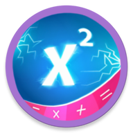

<h1 align="center">Hi 👋, I'm Yadnyesh Borole</h1>
<h3 align="center">A Full-Stack Developer | Game Dev Enthusiast | UI/UX Explorer</h3>

    

  

---

### 🚀 About Me

- 🔭 Currently working on **a Math Learning Android App using Java and Firebase**
- 🧠 Exploring **Unity Game Development & 3D Modelling with Blender**
- 🌐 Interested in **MERN Stack, Electron apps, and system design**
- 💬 Ask me about **React, Node.js, Android, Electron, MongoDB, and UI design**

---

### 📱 Featured Project
<table> <tr> <td align="center" width="30%">  </td> <td width="70%">
<h4>📀 YG Studio Cal</h4>
A powerful all-in-one Android calculator app.

<ul>
  <li>✩ Standard & Scientific Calculator</li>
  <li>✩ Date & Time Calculator</li>
  <li>✩ Quadratic Solver</li>
  <li>✩ Unit Converter</li>
  <li>✩ Local History Storage</li>
</ul>

📲 <a href="https://ygstudio-game.github.io/YSWEBSITEe/data/YG-Studio.cal.apk">Download APK</a> 

</td> </tr> </table>

**Project websites**

 ✨ <a href="https://ygstudio-game.github.io/YSWEBSITEe/">Project Website</a>

### 🌐 Connect With Me

  
  
  

---

### 💻 Languages and Tools

#### 🎮 Game & App Dev:

---

### 📊 GitHub Analytics

  

&nbsp;
  

  <!--  -->

---

 
### ✨ Fun Fact
> 🧠 I love solving logic puzzles and optimizing real-world workflows with automation.

---
